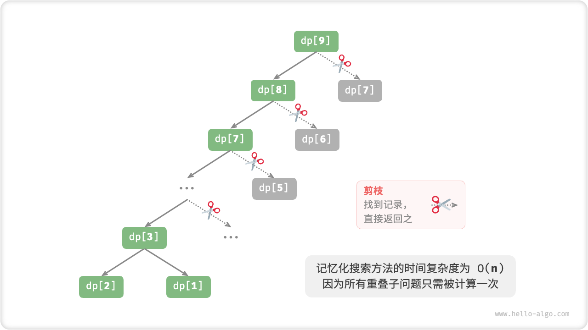

# 初探动态规划

「动态规划 Dynamic Programming」是一种用于解决复杂问题的优化算法，它把一个问题分解为一系列更小的子问题，并把子问题的解存储起来以供后续使用，从而避免了重复计算，提升了解题效率。

在本节中，我们先从一个动态规划的经典例题入手，先给出它的暴力回溯解法，观察其中包含的重叠子问题，再一步步导出更高效的动态规划解法。

!!! question "爬楼梯"

    给定一个共有 $n$ 阶的楼梯，你每步可以上 $1$ 阶或者 $2$ 阶，请问有多少种方案可以爬到楼顶。

如下图所示，对于一个 $3$ 阶楼梯，共有 $3$ 种方案可以爬到楼顶。


本题的目标是求解方案数量，**我们可以考虑通过回溯来穷举所有可能性**。具体来说，将爬楼梯想象为一个多轮选择的过程：从地面出发，每轮选择上 $1$ 阶或 $2$ 阶，每当到达楼梯顶部时就将方案数量加 $1$ ，当越过楼梯顶部时就将其剪枝。

=== "Java"

    ```java title="climbing_stairs_backtrack.java"
    [class]{climbing_stairs_backtrack}-[func]{backtrack}

    [class]{climbing_stairs_backtrack}-[func]{climbingStairsBacktrack}
    ```

=== "C++"

    ```cpp title="climbing_stairs_backtrack.cpp"
    [class]{}-[func]{backtrack}

    [class]{}-[func]{climbingStairsBacktrack}
    ```

=== "Python"

    ```python title="climbing_stairs_backtrack.py"
    [class]{}-[func]{backtrack}

    [class]{}-[func]{climbing_stairs_backtrack}
    ```

=== "Go"

    ```go title="climbing_stairs_backtrack.go"
    [class]{}-[func]{backtrack}

    [class]{}-[func]{climbingStairsBacktrack}
    ```

=== "JavaScript"

    ```javascript title="climbing_stairs_backtrack.js"
    [class]{}-[func]{backtrack}

    [class]{}-[func]{climbingStairsBacktrack}
    ```

=== "TypeScript"

    ```typescript title="climbing_stairs_backtrack.ts"
    [class]{}-[func]{backtrack}

    [class]{}-[func]{climbingStairsBacktrack}
    ```

=== "C"

    ```c title="climbing_stairs_backtrack.c"
    [class]{}-[func]{backtrack}

    [class]{}-[func]{climbingStairsBacktrack}
    ```

=== "C#"

    ```csharp title="climbing_stairs_backtrack.cs"
    [class]{climbing_stairs_backtrack}-[func]{backtrack}

    [class]{climbing_stairs_backtrack}-[func]{climbingStairsBacktrack}
    ```

=== "Swift"

    ```swift title="climbing_stairs_backtrack.swift"
    [class]{}-[func]{backtrack}

    [class]{}-[func]{climbingStairsBacktrack}
    ```

=== "Zig"

    ```zig title="climbing_stairs_backtrack.zig"
    [class]{}-[func]{backtrack}

    [class]{}-[func]{climbingStairsBacktrack}
    ```

=== "Dart"

    ```dart title="climbing_stairs_backtrack.dart"
    [class]{}-[func]{backtrack}

    [class]{}-[func]{climbingStairsBacktrack}
    ```

## 方法一：暴力搜索

回溯算法通常并不显式地对问题进行拆解，而是将问题看作一系列决策步骤，通过试探和剪枝，搜索所有可能的解。

对于本题，我们可以尝试将问题拆解为更小的子问题。设爬到第 $i$ 阶共有 $dp[i]$ 种方案，那么 $dp[i]$ 就是原问题，其子问题包括:

$$
dp[i-1] , dp[i-2] , \cdots , dp[2] , dp[1]
$$

由于每轮只能上 $1$ 阶或 $2$ 阶，因此当我们站在第 $i$ 阶楼梯上时，上一轮只可能站在第 $i - 1$ 阶或第 $i - 2$ 阶上，换句话说，我们只能从第 $i -1$ 阶或第 $i - 2$ 阶前往第 $i$ 阶。因此，**爬到第 $i - 1$ 阶的方案数加上爬到第 $i - 2$ 阶的方案数就等于爬到第 $i$ 阶的方案数**，即：

$$
dp[i] = dp[i-1] + dp[i-2]
$$


也就是说，在爬楼梯问题中，**各个子问题之间不是相互独立的，原问题的解可以由子问题的解构成**。

我们可以基于此递推公式写出暴力搜索代码：以 $dp[n]$ 为起始点，**从顶至底地将一个较大问题拆解为两个较小问题的和**，直至到达最小子问题 $dp[1]$ 和 $dp[2]$ 时返回。其中，最小子问题的解是已知的，即爬到第 $1$ , $2$ 阶分别有 $1$ , $2$ 种方案。

观察以下代码，它与回溯解法都属于深度优先搜索，但比回溯算法更加简洁。

=== "Java"

    ```java title="climbing_stairs_dfs.java"
    [class]{climbing_stairs_dfs}-[func]{dfs}

    [class]{climbing_stairs_dfs}-[func]{climbingStairsDFS}
    ```

=== "C++"

    ```cpp title="climbing_stairs_dfs.cpp"
    [class]{}-[func]{dfs}

    [class]{}-[func]{climbingStairsDFS}
    ```

=== "Python"

    ```python title="climbing_stairs_dfs.py"
    [class]{}-[func]{dfs}

    [class]{}-[func]{climbing_stairs_dfs}
    ```

=== "Go"

    ```go title="climbing_stairs_dfs.go"
    [class]{}-[func]{dfs}

    [class]{}-[func]{climbingStairsDFS}
    ```

=== "JavaScript"

    ```javascript title="climbing_stairs_dfs.js"
    [class]{}-[func]{dfs}

    [class]{}-[func]{climbingStairsDFS}
    ```

=== "TypeScript"

    ```typescript title="climbing_stairs_dfs.ts"
    [class]{}-[func]{dfs}

    [class]{}-[func]{climbingStairsDFS}
    ```

=== "C"

    ```c title="climbing_stairs_dfs.c"
    [class]{}-[func]{dfs}

    [class]{}-[func]{climbingStairsDFS}
    ```

=== "C#"

    ```csharp title="climbing_stairs_dfs.cs"
    [class]{climbing_stairs_dfs}-[func]{dfs}

    [class]{climbing_stairs_dfs}-[func]{climbingStairsDFS}
    ```

=== "Swift"

    ```swift title="climbing_stairs_dfs.swift"
    [class]{}-[func]{dfs}

    [class]{}-[func]{climbingStairsDFS}
    ```

=== "Zig"

    ```zig title="climbing_stairs_dfs.zig"
    [class]{}-[func]{dfs}

    [class]{}-[func]{climbingStairsDFS}
    ```

=== "Dart"

    ```dart title="climbing_stairs_dfs.dart"
    [class]{}-[func]{dfs}

    [class]{}-[func]{climbingStairsDFS}
    ```

下图展示了该方法形成的递归树。对于问题 $dp[n]$ ，递归树的深度为 $n$ ，时间复杂度为 $O(2^n)$ 。指数阶的运行时间增长地非常快，如果我们输入一个比较大的 $n$ ，则会陷入漫长的等待之中。


实际上，**指数阶的时间复杂度是由于「重叠子问题」导致的**。例如，问题 $dp[9]$ 被分解为子问题 $dp[8]$ 和 $dp[7]$ ，问题 $dp[8]$ 被分解为子问题 $dp[7]$ 和 $dp[6]$ ，两者都包含子问题 $dp[7]$ ，而子问题中又包含更小的重叠子问题，子子孙孙无穷尽也，绝大部分计算资源都浪费在这些重叠的问题上。

## 方法二：记忆化搜索

为了提升算法效率，**我们希望所有的重叠子问题都只被计算一次**。具体来说，考虑借助一个数组 `mem` 来记录每个子问题的解，并在搜索过程中这样做：

- 当首次计算 $dp[i]$ 时，我们将其记录至 `mem[i]` ，以便之后使用；
- 当再次需要计算 $dp[i]$ 时，我们便可直接从 `mem[i]` 中获取结果，从而将重叠子问题剪枝；

=== "Java"

    ```java title="climbing_stairs_dfs_mem.java"
    [class]{climbing_stairs_dfs_mem}-[func]{dfs}

    [class]{climbing_stairs_dfs_mem}-[func]{climbingStairsDFSMem}
    ```

=== "C++"

    ```cpp title="climbing_stairs_dfs_mem.cpp"
    [class]{}-[func]{dfs}

    [class]{}-[func]{climbingStairsDFSMem}
    ```

=== "Python"

    ```python title="climbing_stairs_dfs_mem.py"
    [class]{}-[func]{dfs}

    [class]{}-[func]{climbing_stairs_dfs_mem}
    ```

=== "Go"

    ```go title="climbing_stairs_dfs_mem.go"
    [class]{}-[func]{dfs}

    [class]{}-[func]{climbingStairsDFSMem}
    ```

=== "JavaScript"

    ```javascript title="climbing_stairs_dfs_mem.js"
    [class]{}-[func]{dfs}

    [class]{}-[func]{climbingStairsDFSMem}
    ```

=== "TypeScript"

    ```typescript title="climbing_stairs_dfs_mem.ts"
    [class]{}-[func]{dfs}

    [class]{}-[func]{climbingStairsDFSMem}
    ```

=== "C"

    ```c title="climbing_stairs_dfs_mem.c"
    [class]{}-[func]{dfs}

    [class]{}-[func]{climbingStairsDFSMem}
    ```

=== "C#"

    ```csharp title="climbing_stairs_dfs_mem.cs"
    [class]{climbing_stairs_dfs_mem}-[func]{dfs}

    [class]{climbing_stairs_dfs_mem}-[func]{climbingStairsDFSMem}
    ```

=== "Swift"

    ```swift title="climbing_stairs_dfs_mem.swift"
    [class]{}-[func]{dfs}

    [class]{}-[func]{climbingStairsDFSMem}
    ```

=== "Zig"

    ```zig title="climbing_stairs_dfs_mem.zig"
    [class]{}-[func]{dfs}

    [class]{}-[func]{climbingStairsDFSMem}
    ```

=== "Dart"

    ```dart title="climbing_stairs_dfs_mem.dart"
    [class]{}-[func]{dfs}

    [class]{}-[func]{climbingStairsDFSMem}
    ```

观察下图，**经过记忆化处理后，所有重叠子问题都只需被计算一次，时间复杂度被优化至 $O(n)$** ，这是一个巨大的飞跃。实际上，如果不考虑递归带来的额外开销，记忆化搜索解法已经几乎等同于动态规划解法的时间效率。



## 方法三：动态规划

**记忆化搜索是一种“从顶至底”的方法**：我们从原问题（根节点）开始，递归地将较大子问题分解为较小子问题，直至解已知的最小子问题（叶节点）；最终通过回溯将子问题的解逐层收集，得到原问题的解。

**我们也可以直接“从底至顶”进行求解**，得到标准的动态规划解法：从最小子问题开始，迭代地求解较大子问题，直至得到原问题的解。

由于动态规划不包含回溯过程，因此无需使用递归，而可以直接基于递推实现。我们初始化一个数组 `dp` 来存储子问题的解，从最小子问题开始，逐步求解较大子问题。在以下代码中，数组 `dp` 起到了记忆化搜索中数组 `mem` 相同的记录作用。

=== "Java"

    ```java title="climbing_stairs_dp.java"
    [class]{climbing_stairs_dp}-[func]{climbingStairsDP}
    ```

=== "C++"

    ```cpp title="climbing_stairs_dp.cpp"
    [class]{}-[func]{climbingStairsDP}
    ```

=== "Python"

    ```python title="climbing_stairs_dp.py"
    [class]{}-[func]{climbing_stairs_dp}
    ```

=== "Go"

    ```go title="climbing_stairs_dp.go"
    [class]{}-[func]{climbingStairsDP}
    ```

=== "JavaScript"

    ```javascript title="climbing_stairs_dp.js"
    [class]{}-[func]{climbingStairsDP}
    ```

=== "TypeScript"

    ```typescript title="climbing_stairs_dp.ts"
    [class]{}-[func]{climbingStairsDP}
    ```

=== "C"

    ```c title="climbing_stairs_dp.c"
    [class]{}-[func]{climbingStairsDP}
    ```

=== "C#"

    ```csharp title="climbing_stairs_dp.cs"
    [class]{climbing_stairs_dp}-[func]{climbingStairsDP}
    ```

=== "Swift"

    ```swift title="climbing_stairs_dp.swift"
    [class]{}-[func]{climbingStairsDP}
    ```

=== "Zig"

    ```zig title="climbing_stairs_dp.zig"
    [class]{}-[func]{climbingStairsDP}
    ```

=== "Dart"

    ```dart title="climbing_stairs_dp.dart"
    [class]{}-[func]{climbingStairsDP}
    ```

与回溯算法一样，动态规划也使用“状态”概念来表示问题求解的某个特定阶段，每个状态都对应一个子问题以及相应的局部最优解。例如对于爬楼梯问题，状态定义为当前所在楼梯阶数。**动态规划的常用术语包括**：

- 将 $dp$ 数组称为「状态列表」，$dp[i]$ 代表第 $i$ 个状态的解；
- 将最简单子问题对应的状态（即第 $1$ , $2$ 阶楼梯）称为「初始状态」；
- 将递推公式 $dp[i] = dp[i-1] + dp[i-2]$ 称为「状态转移方程」；


细心的你可能发现，**由于 $dp[i]$ 只与 $dp[i-1]$ 和 $dp[i-2]$ 有关，因此我们无需使用一个数组 `dp` 来存储所有状态**，而只需两个变量滚动前进即可。如以下代码所示，由于省去了数组 `dp` 占用的空间，因此空间复杂度从 $O(n)$ 降低至 $O(1)$ 。

=== "Java"

    ```java title="climbing_stairs_dp.java"
    [class]{climbing_stairs_dp}-[func]{climbingStairsDPComp}
    ```

=== "C++"

    ```cpp title="climbing_stairs_dp.cpp"
    [class]{}-[func]{climbingStairsDPComp}
    ```

=== "Python"

    ```python title="climbing_stairs_dp.py"
    [class]{}-[func]{climbing_stairs_dp_comp}
    ```

=== "Go"

    ```go title="climbing_stairs_dp.go"
    [class]{}-[func]{climbingStairsDPComp}
    ```

=== "JavaScript"

    ```javascript title="climbing_stairs_dp.js"
    [class]{}-[func]{climbingStairsDPComp}
    ```

=== "TypeScript"

    ```typescript title="climbing_stairs_dp.ts"
    [class]{}-[func]{climbingStairsDPComp}
    ```

=== "C"

    ```c title="climbing_stairs_dp.c"
    [class]{}-[func]{climbingStairsDPComp}
    ```

=== "C#"

    ```csharp title="climbing_stairs_dp.cs"
    [class]{climbing_stairs_dp}-[func]{climbingStairsDPComp}
    ```

=== "Swift"

    ```swift title="climbing_stairs_dp.swift"
    [class]{}-[func]{climbingStairsDPComp}
    ```

=== "Zig"

    ```zig title="climbing_stairs_dp.zig"
    [class]{}-[func]{climbingStairsDPComp}
    ```

=== "Dart"

    ```dart title="climbing_stairs_dp.dart"
    [class]{}-[func]{climbingStairsDPComp}
    ```

**我们将这种空间优化技巧称为「状态压缩」**。在许多动态规划问题中，当前状态仅与前面有限个状态有关，不必保存所有的历史状态，这时我们可以应用状态压缩，只保留必要的状态，通过“降维”来节省内存空间。

总的看来，子问题分解是一种通用的算法思路，在分治算法、动态规划、回溯算法中各有特点：

- 分治算法将原问题划分为几个独立的子问题，然后递归解决子问题，最后合并子问题的解得到原问题的解。例如，归并排序将长数组不断划分为两个短子数组，再将排序好的子数组合并为排序好的长数组。
- 动态规划也是将原问题分解为多个子问题，但与分治算法的主要区别是，**动态规划中的子问题往往不是相互独立的**，原问题的解依赖于子问题的解，而子问题的解又依赖于更小的子问题的解。因此，动态规划通常会引入记忆化，保存已经解决的子问题的解，避免重复计算。
- 回溯算法在尝试和回退中穷举所有可能的解，并通过剪枝避免不必要的搜索分支。原问题的解由一系列决策步骤构成，我们可以将每个决策步骤之后的剩余问题看作为一个子问题。
